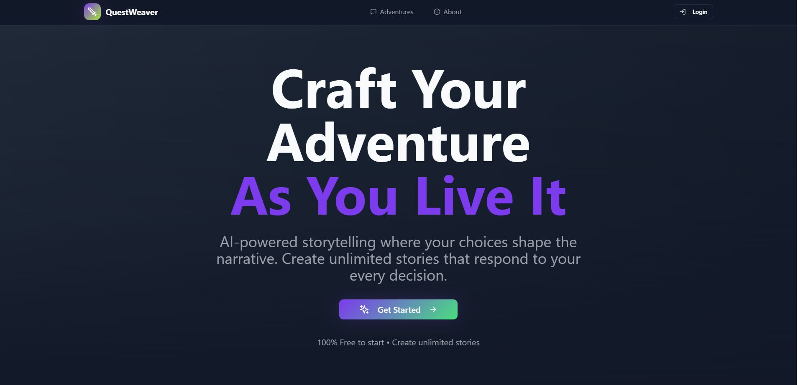
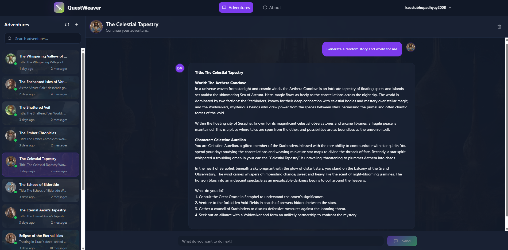

# QuestWeaver - AI-Powered Interactive Storytelling Platform

## Overview

QuestWeaver is a full-stack AI platform that generates dynamic, personalized interactive narratives. Built with cutting-edge AI technologies, it creates text-based adventure stories that adapt to user choices while maintaining narrative coherence and visual immersion through automated image generation.

**Check out the Project Here:** [QuestWeaver](https://quest-weaver.vercel.app/)
  

## Key Features

- **AI-Powered Storytelling**: GPT-4 integration for contextually-aware narrative generation
- **Semantic Memory System**: RAG implementation using ChromaDB for persistent story continuity
- **Visual World Building**: Automated character and world image generation via Stable Diffusion XL
- **Real-time Interactivity**: Dynamic story progression based on user decisions
- **Multi-variant Storage**: Optimized image delivery with AWS S3 CDN integration

## Technical Architecture

### Frontend
- **React 18** with TypeScript for type-safe component development
- **Tailwind CSS** for responsive, modern UI design
- **Real-time state management** for seamless user interactions

### Backend
- **FastAPI** Python framework with async request handling
- **Rate limiting** and authentication middleware
- **Background task processing** for image generation pipelines

### AI/ML Integration
- **OpenAI GPT-4 API** for dynamic narrative generation
- **LangChain framework** for AI workflow orchestration
- **ChromaDB vector database** for semantic memory retrieval
- **Stable Diffusion XL** for text-to-image generation via Hugging Face
- **OpenAI embeddings** for context-aware story progression

### Cloud Infrastructure
- **AWS S3** for scalable image storage and CDN delivery
- **Supabase** for PostgreSQL database and OAuth authentication
- **Multi-variant image processing** with automated retry mechanisms

